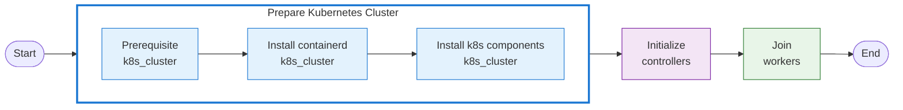

# Kubernetes Cluster Setup with Ansible

This project provides an automated way to set up a Kubernetes cluster using Ansible playbooks. It includes roles for configuring prerequisites, installing container runtime, setting up Kubernetes components, initializing the controller node, and joining worker nodes.

## Project Structure

```
.
├── group_vars/
│   └── all.yml                 # Global variables for the cluster
├── roles/
│   ├── cni/                    # Container Network Interface setup
│   ├── containerd/             # Container runtime installation
│   ├── kubernetes/             # Kubernetes components installation
│   ├── initialize/             # Controller node initialization
│   ├── plugin/                 # Install Additional plugins(optional)
│   ├── prerequisite/           # System prerequisites setup
│   └── join/                   # Worker node joining 
├── inventory.ini               # Inventory file defining cluster nodes
├── playbook-install.yml        # Main installation playbook
├── playbook-reset.yml          # Reset/cleanup playbook
├── playbook-verify.yml         # Verify cluster status playbook
└── playbook-plugin.yml         # Install plugins(optional)
```

## Prerequisites

- Ansible installed on the control machine
- SSH access to all target nodes
- Target nodes running a supported Linux distribution (Ubuntu/Debian or CentOS/RHEL)

## Configuration

### Inventory File

Update [inventory.ini](./inventory.ini) to match your cluster topology:

```ini
[controllers]
controller-1 ansible_host=<CONTROLLER1_IP> ansible_user=<USERNAME>
...

[workers]
worker-1 ansible_host=<WORKER1_IP> ansible_user=<USERNAME>
worker-2 ansible_host=<WORKER2_IP> ansible_user=<USERNAME>
...

[k8s_cluster:children]
controllers
workers

[all:vars]
ansible_ssh_private_key_file=~/.ssh/id_rsa
ansible_ssh_common_args='-o UserKnownHostsFile=/dev/null -o StrictHostKeyChecking=no'
```

### Group Variables

Modify `group_vars/all.yml` to configure your cluster settings:

- Kubernetes version
- Pod and service CIDR ranges
- controller node IP address
- Container runtime (default: containerd)

## Playbooks

### Installation

To set up the Kubernetes cluster:

```bash
ansible-playbook -i inventory.ini playbook-install.yml
```
Alternatively, you can use the following command to install Kubernetes cluster:
```bash
ansible-playbook -i inventory.ini playbook-install.yml --tags=prepare,init,join
```

This will:
1. Set up system prerequisites on all nodes
2. Install container runtime (containerd)
3. Install Kubernetes components(kubeadm, kubelet, kubectl)
4. Initialize the controller node
5. Join worker nodes to the cluster



### Install Plugins (Optional)

To install Kubernetes plugins (Metrics Server, Local Path Provisioner, Kubernetes Dashboard, Metallb LoadBalancer,... etc. Refer to [plugin declaration](./roles/plugin/defaults/main.yml) for more details):

```bash
ansible-playbook -i inventory.ini playbook-plugin.yml
```

You can enable or disable specific plugins using the following environment variables or Ansible variables (default: `true`):

| Plugin | Variable / Env Var | Description |
|--------|-------------------|-------------|
| All Plugins | `K8S_PLUGINS_ENABLED` | Master flag to enable/disable all plugins |
| Metrics Server | `K8S_METRICS_SERVER_ENABLED` | Enable Metrics Server |
| Local Path Provisioner | `K8S_LOCAL_PATH_PROVISIONER_ENABLED` | Enable Local Path Provisioner |
| MetalLB | `K8S_METALLB_ENABLED` | Enable MetalLB Load Balancer |
| Dashboard | `K8S_DASHBOARD_ENABLED` | Enable Kubernetes Dashboard |

Example usage:
```bash
# Disable MetalLB
K8S_METALLB_ENABLED=false ansible-playbook -i inventory.ini playbook-plugin.yml

or

ansible-playbook -i inventory.ini playbook-plugin.yml -e K8S_METALLB_ENABLED=false
```


### Verification

To verify the cluster status:

```bash
ansible-playbook -i inventory.ini playbook-verify.yml
```

### Reset

To reset and clean up the cluster:

```bash
ansible-playbook -i inventory.ini playbook-reset.yml
```

This will:
1. Reset kubeadm on all nodes
2. Remove Kubernetes configuration files
3. Clean up network configurations

## Roles Overview

### Prerequisites (`prerequisite`)
- Disables swap
- Loads required kernel modules
- Configures sysctl parameters
- Sets up host mappings in `/etc/hosts`

### Install Container Runtime (`containerd`)
- Installs and configures containerd
- Sets up repositories based on OS family

### Install Kubernetes components (`kubernetes`)
- Installs kubeadm, kubelet, and kubectl
- Starts and enables kubelet service

### Initialize Kubernetes cluster (`initialize`)
- Initializes the Kubernetes control plane
- Sets up CNI networking
- Generates worker join commands

### Join worker nodes into cluster (`join`)
- Joins worker nodes to the cluster using the generated token

### Install CNI plugins (`cni`)
- Installs Flannel CNI plugin(by default) for pod networking

### Install Kubernetes plugins (`plugin`) - (optional)
- Installs plugins for Kubernetes

## Customization

You can customize various aspects of the deployment by modifying:
- Variables in [group_vars/all.yml](group_vars/all.yml)
- Templates in role directories
- Tasks in role-specific task files

## Security Considerations

- Review and update security configurations as needed
- Use secure passwords and tokens
- Regularly update Kubernetes versions
- Implement RBAC and network policies

## Troubleshooting

Common issues and solutions:
1. If playbooks fail due to connectivity issues, check SSH access to all nodes
2. For permission errors, ensure proper sudo privileges on target nodes
3. If reset fails, manually clean up remaining configurations

## License

This project is licensed under the MIT License - see the [LICENSE](LICENSE) file for details.
